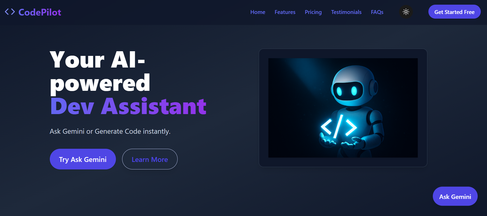

# 🚀 CodePilot – AI-Powered Developer Landing Page via Vibe Coding 

# 🚀 CodePilot – Your AI-Powered Dev Assistant

CodePilot is a modern SaaS-style web app that supercharges your development workflow using AI. Powered by Gemini API, CodePilot offers instant code generation, intelligent answers to dev questions, and smart FAQs — all in a clean, responsive UI.

 <!-- Replace with actual screenshot if needed -->

---

## 🔥 Features

- ⚡ Ask Gemini – Chat interface for AI-powered development help
- 🔧 Code Generator – Get production-ready code snippets
- ❓ Smart FAQs – Search and filter FAQs with ease
- 📱 Responsive design – Works beautifully across devices
- 🌙 Dark mode toggle – Built-in theme switching
- ✨ Smooth scroll, animations (Framer Motion), and gradients
- 🎨 Tailwind CSS styling with modern UI/UX
- 🧠 Tool Showcase – AI dev tools carousel (ChatGPT, Copilot, etc.)
---

Live Demo 👉 [codepilot-khaki.vercel.app](https://codepilot-khaki.vercel.app)  
GitHub Repo 👉 [github.com/Mukulpal6050/codepilot](https://github.com/Mukulpal6050/codepilot)

## 🧭 Overview

CodePilot is a modern, responsive SaaS landing page created entirely using **AI coding assistants** like ChatGPT, Gemini, Cursor AI through vibe coding workflows.  
Submitted for the **AI Vibe Coder (Founding Engineer)** internship at **ADmyBRAND.com**, this project is a showcase of full-stack thinking, prompt engineering, and pixel-perfect execution.

## 🧠 AI Usage Report

| AI Agent        | Role in Development                                       |
|-----------------|------------------------------------------------------------|
| **Gemini AI**   | Prompt API Integration, FAQ Bot, Code Generator, Chat Modal |
| **ChatGPT**     | Component structure, Tailwind layout, dark mode, animation |
| **Cursor IDE**  | Real-time refactor, file tree mapping, prompt injection    |

_No manual typing — all sections built through engineered prompts using Vibe Coding._

## 🎨 Features

- ⚡ Full Vite + React + Tailwind stack
- 🌗 Dark mode toggle
- 🎯 Responsive layout with animated components
- 🤖 Real-time Gemini Code Generator + FAQ Assistant
- 💬 Floating Gemini Chat Modal
- 🧰 AI Tool Marquee with branding icons
- 🧠 Intelligent FAQs using @headlessui
- 💸 Gradient-based Pricing Cards
- 💬 Testimonials with auto-generated avatars
- 📈 Modular sections (`Why`, `CTA`, `Hero`, etc.)

## 🧩 Component Breakdown

| Component          | Purpose                                               |
|--------------------|-------------------------------------------------------|
| `Header`           | Sticky navigation + theme toggle                      |
| `Hero`             | Full-screen entry with CTA                            |
| `ToolMarquee`      | AI tools scrolling showcase                           |
| `GeminiChat`       | Gemini-powered floating assistant modal               |
| `CodeGenerator`    | Prompt-based code generation                          |
| `Features`         | Feature grid with icons                               |
| `WhyCodePilot`     | Value prop cards                                      |
| `Pricing`          | Modular, responsive pricing cards                     |
| `Testimonials`     | Avatar + quote testimonial layout                     |
| `CallToAction`     | Gradient CTA section + SVG curve                      |
| `FAQ`              | Animated disclosure for top queries                   |
| `SmartFaqHelper`   | Gemini-powered custom FAQ field                       |
| `Footer`           | Full branding, social links, and newsletter           |

## 📁 Folder Structure

src/ ├── components/ │ ├── Header.jsx │ ├── Hero.jsx │ ├── Features.jsx │ ├── Pricing.jsx │ ├── Testimonials.jsx │ ├── CallToAction.jsx │ ├── FAQ.jsx │ ├── Footer.jsx │ ├── ToolMarquee.jsx │ ├── CodeGenerator.jsx │ ├── SmartFaqHelper.jsx │ ├── GeminiChat.jsx │ ├── MobileMenu.jsx │ └── WhyCodePilot.jsx ├── App.jsx ├── main.jsx ├── index.css

## 🧪 Tech Stack

- **Frontend**: React, TailwindCSS, Vite
- **AI APIs**: Gemini 1.5 Pro
- **Deployment**: Vercel
- **Icons**: Lucide React
- **Animations**: framer-motion
- **Syntax Highlighting**: react-syntax-highlighter

## 🌐 Deployment

- Hosted on [Vercel](https://vercel.com)
- Live Site: [`https://codepilot-khaki.vercel.app`](https://codepilot-khaki.vercel.app)

## 🔐 Environment Variable Setup

## 📝 Internship Submission

- 📌 Internship: **AI Vibe Coder (Founding Engineer)** – ADmyBRAND.com  
- 📄 Task Chosen: **Task B – Modern SaaS Landing Page & Component System**  
- 🎯 Submitted via: Google Form + Live Link + GitHub  
- 📅 Deadline: August 6, 2025  
- 📎 Assignment Brief: [View Task](https://docs.google.com/document/d/1WBGniP_KBcfNc7Zv3A08K8_HW8GvZwND-HAkqYxbyxs/edit)

## 👨‍💻 About the Developer

Built by **Mukul Pal**, a full-stack developer with expertise in MERN, Tailwind, Next.js, React Native, Firebase, and LinkedIn API.  
This project was built entirely through vibe coding using AI agents — no manual code typing.  
I engineered every module, style, and interaction via prompts.

Connect with me:  
- 🌐 [LinkedIn](https://www.linkedin.com/in/mukul-pal-4a1b8b253/)  
- 🐙 [GitHub](https://github.com/Mukulpal6050)  
- 🐦 [Twitter](https://x.com/m_vines1)  

---

🔥 Add this project proudly to your portfolio — it showcases not just your coding skill, but your innovation mindset and AI fluency.

Want me to paste this directly into your repo’s README or format it for PDF conversion? Just say the word, Mukul — we’ll make sure the vibe matches your vision 💼🧪

Live Demo 👉 [codepilot-khaki.vercel.app](https://codepilot-khaki.vercel.app)
